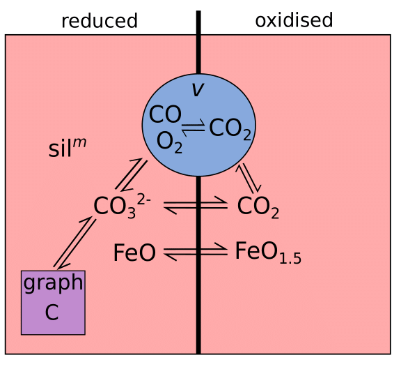
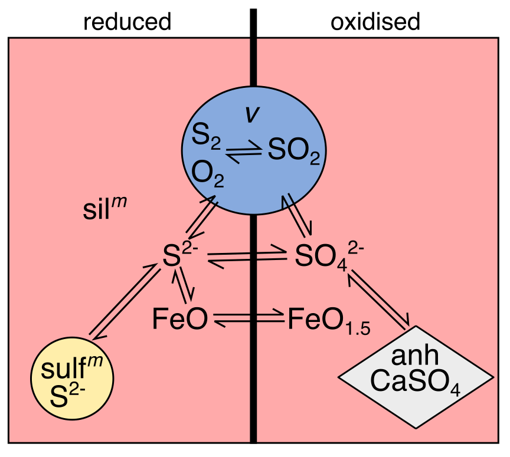
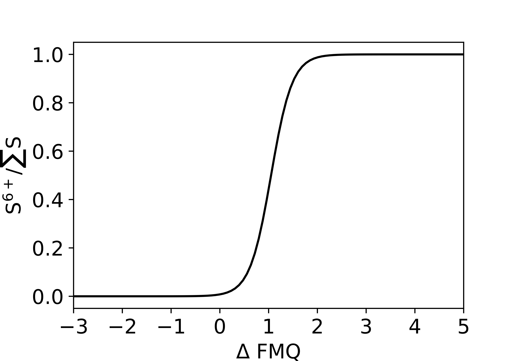
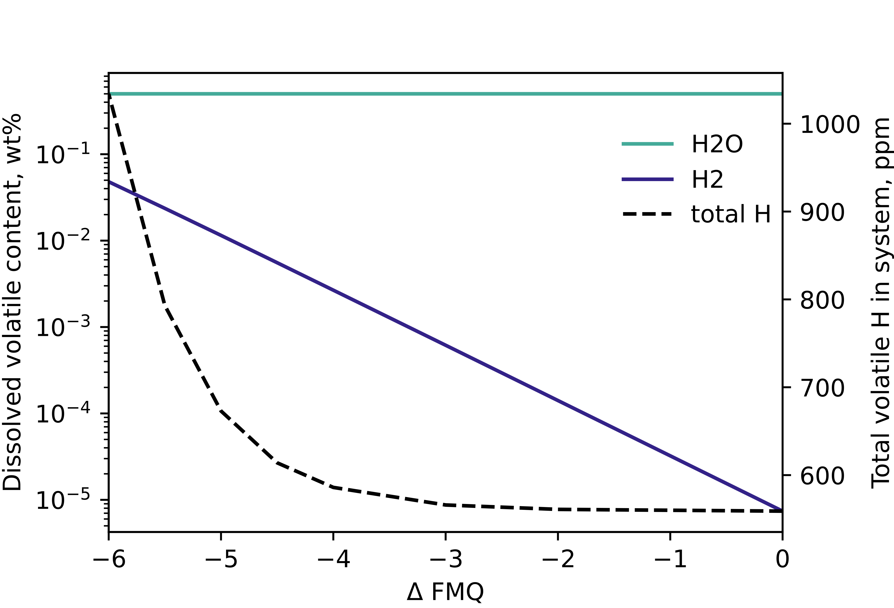
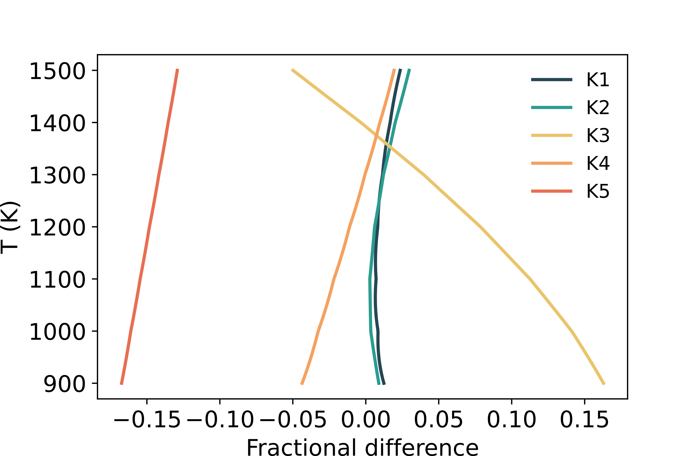
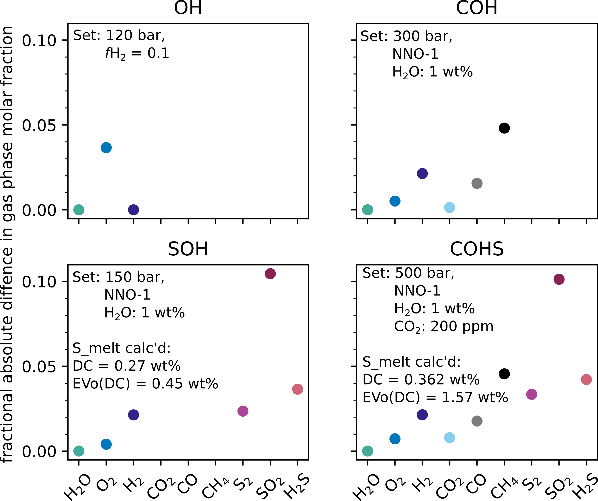
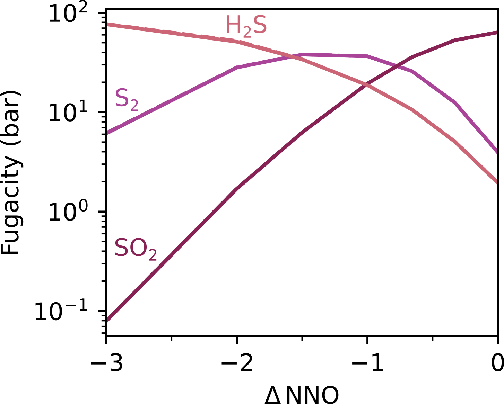
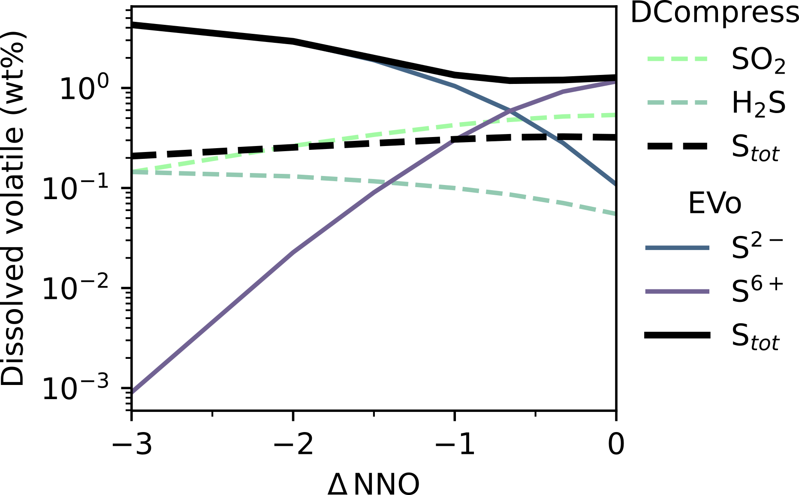
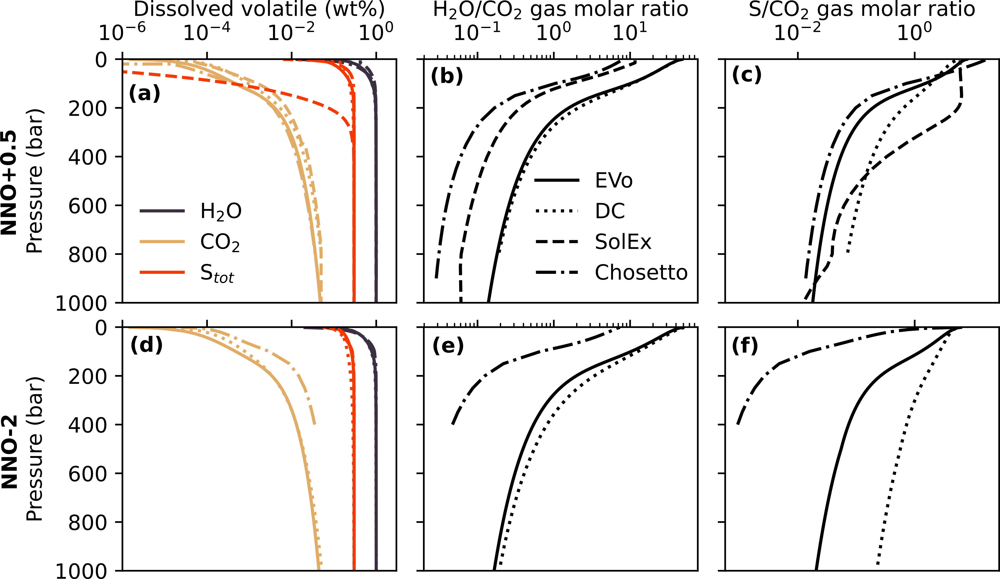

.. role:: raw-latex(raw)
   :format: latex
..

.. _`c:models`:

EVo Model Description
=====================

EVo is designed to model the isothermal ascent of magma during eruption,
assuming that magma degassing during ascent is primarily due to the
resultant pressure change. A 3-phase system is used, where the silicate
melt and the gas phase coexist in constant thermochemical equilibrium,
alongside a solid graphite phase under sufficiently reduced conditions.
The physical-chemical separation of gas and melt is implemented as being
either impossible (closed-system), or instantaneous (open system - see
:ref:`section_run_types`). The highly complex nature of volcanic
systems necessitates simplifications in my approach; crystallisation
kinetics and sulfide formation (see :ref:`section_cands`) are
neglected, so in those cases where precipitation of solids during ascent
is important in driving degassing, EVo may underestimate the volume and
composition of gases evolved from the melt.

.. _evo_schem:
.. figure:: images/evo_overview.*

   A schematic overview of EVo, and it’s place in a physical system.

:numref:`evo_schem` shows a schematic of how EVo represents a volcanic system, calculating
the composition of the gas and melt phase at stages from the pressure of
volatile saturation to the surface.

.. _section_overview_of_model:

Overview of the chemical model
------------------------------

EVo computes the gas and melt volatile composition for systems of up to
5 volatile elements (C, O, H, S and N, in combinations of OH, COH, SOH,
COHS and COHSN), using an ‘equilibrium constants and mass balance’
method first established by Holloway (1987) and used since by
several degassing models, including Iacono-Marziano et al. (2012), 
Gaillard and Scaillet (2014), and Burgisser et al. (2015). 
As stated by Holloway (1987), this method "requires that enough equilibrium
constant equations are used so that,
when combined with the equation for mass balance, there are an equal
number of equations and unknowns". By combining the equilibrium constant
equations which define homogenous gas-gas equilibria, and solubility
laws which control heterogeneous gas-melt equilibria, at any given point
the entire gas-melt system can be defined.

EVo considers 10 gas-phase species in the full COHSN system: |H2O|, |H2|, |O2|, |CO2|, CO, |CH4|, |S2|, |SO2|, |H2S| and |N2|. Subsets of these species are used in calculations if systems
with fewer components are modelled, e.g., by definition the COH system
does not include S or N-bearing species and so comprises just 6
gas-phase species. In a typical terrestrial volcanic gas, :math:`>`\ 99%
(by mol) will be made up of |H2O|, |H2|, |CO2|, |SO2|, |H2S| and |N2| (Fischer and
Chiodini, 2015), so the 10 species EVo considers are sufficient to model the 
bulk gas-phase chemistry, although it omits some trace species such as which
have been detected at various volcanoes (e.g., Mori and Notsu, 1997; 
Oppenheimer and Kyle, 2008; Sawyer et al., 2008).
OCS in particular has been omitted due to the lack of solubility data in
magmas. This reflects a limitation of this approach: even when the
homogenous gas-phase equilibria are known (which for very many species
they are), unless there is corresponding data for the solubility of a
species in silicate liquids it cannot be included and a self-consistent
solution be obtained.

A set of five homogenous gas-phase equilibria, described in :eq:`eq_k1` 
to :eq:`eq_k5`, define the speciation of the gas phase

.. math:: \ce{H2 + \frac{1}{2} O2 <=> H2O}
   :label: eq_k1

.. math:: \ce{CO + \frac{1}{2} O2 <=> CO2}
   :label: eq_k2

.. math:: \ce{CH4 + 2O2 <=> CO2 + 2|H2O|}
   :label: eq_k3

.. math:: \ce{\frac{1}{2} S2 + H2O <=> H2S + \frac{1}{2} O2}
   :label: eq_k4

.. math:: \ce{\frac{1}{2} S2 + O2 <=> SO2}.
   :label: eq_k5

At thermochemical equilibrium, the abundance of each species in the gas
phase are related to an equilibrium constant, :math:`K_i`, one for each
reaction in :eq:`eq_k1` to :eq:`eq_k5`. The general equation for these 
equilibria is given by

.. math::
   :label: eq_base_eqbm
   
   a\ce{A} + b\ce{B} \ce{<=>} c\ce{C} + d\ce{D},

which has a general equilibrium constant reaction equation of

.. math::
   :label: eq_k_base_eqbm
   
   K_{2.6} = \frac{[\ce{C}]^c\,[\ce{D}]^d}{[\ce{A}]^a\,[\ce{B}]^b},

where square brackets denote activity. For real gases, :math:`K_i` can
be calculated in terms of fugacity, :math:`f_i`, so that for, e.g.,
Eq. :eq:`eq_k1`

.. math::
   :label: eq_k1_ex
   
   K_1 = \frac{f_{\ce{|H2O|}}}{f_{\ce{H2}}\,{f_{\ce{O2}}}^{0.5}}.

The fugacity :math:`f_i` of a real gas is an effective partial pressure,
which replaces the mechanical partial pressure in an accurate
computation of the chemical equilibrium constant. In EVo ideal mixing of
real gases is assumed, so the fugacity of species :math:`i` is defined
as

.. math::
   :label: eq_fugacity

   f_i = \gamma_i\,P_i = \gamma_i\,X^v_i\,P,

where :math:`\gamma_i` is the fugacity coefficient representing the
deviation of the gas from ideality, so for an ideal gas :math:`\gamma_i`
= 1. :math:`P_i` is the partial pressure of :math:`i`, :math:`x^v_i` is
the mole fraction of i in the gas mixture, and :math:`P` is the total
pressure. :math:`x^v_i` is such that when the gas phase is composed of
:math:`n` species, each with a mole fraction :math:`x^v_i`,

.. math::
   :label: eq_sumtoone

   \sum^{n}_{i=1}\,X^v_i = 1.

The Lewis and Randall rule is applied to the calculation of
:math:`\gamma_i`, which states that the fugacity coefficient of species
i in the gas mixture equals that of the pure species at the same
pressure and temperature. The coefficients :math:`\gamma_{\ce{|H2O|}}`,
:math:`\gamma_{\ce{CO2}}` and :math:`\gamma_{\ce{N2}}` are from
Holland and Powell (1991),
:math:`\gamma_{\ce{H2}}` is from Shaw and Wones (1964), and the remaining
coefficients are from Shi and Saxena (1992). Coefficients taken from Shi and Saxena
(1992) are only calibrated down to 1 bar. These coefficients are therefore set as
:math:`\gamma_i` = 1 for :math:`P\,\leq\,1` – as gas behaviour tends to
be increasingly ideal at lower pressures this is a valid assumption.

Calculating reaction constants
~~~~~~~~~~~~~~~~~~~~~~~~~~~~~~

The equilibrium constants of reactions :eq:`eq_k1` to :eq:`eq_k5` are
calculated using the Gibbs free energy of the reaction as

.. math:: \ln K = \frac{\Delta_rG^{\circ}}{-R\,T}.
   :label: eq_calc_k

:math:`\Delta_rG^{\circ}`, the Gibbs free energy of reaction, is the
difference between the Gibbs free energies of formation
(:math:`\Delta_fG^{\circ}`) for products and reactants *in their
standard states*, thus:

.. math:: \Delta_rG^{\circ} = \Delta_fG^{\circ}_{products} - \Delta_fG^{\circ}_{reactants}.
   :label: eq_gibbs_reaction

Therefore to calculate :math:`\Delta_rG^{\circ}_1`, the Gibbs free
energy of reaction :eq:`eq_k1`:

.. math:: \ce{H2 + \frac{1}{2} O2 <=> |H2O|},

.. math:: \Delta_rG^{\circ}_1 = \Delta_fG^{\circ}_{\ce{|H2O|}} - \left(\Delta_fG^{\circ}_{\ce{H2}} + 0.5 \Delta_fG^{\circ}_{\ce{O2}}\right).
   :label: eq_gibbs_1

:math:`\Delta_fG^{\circ}` values are taken from the JANAF tables
(Chase, 1998), with linear interpolation between temperatures using
the NumPy ‘interp’ function (Harris et al., 2020). As
equilibrium constants are pressure-independent, and EVo assumes
decompression is isothermal, :math:`K` values are only computed once,
during the initial setup of a decompression calculation.

.. _`section:volatile_solubility`:

Volatile solubility and oxygen exchange
~~~~~~~~~~~~~~~~~~~~~~~~~~~~~~~~~~~~~~~

The solubility of a species is usually defined as the maximum
concentration of a volatile which can remain in solution while
co-existing with a pure gas phase of the same species. In a
multicomponent system like that of EVo, it is assumed that the
solubility of a species is related to the partial pressure/fugacity of
the individual species :math:`i`. Over the past 30 years a plethora of
solubility laws, particularly for |H2O| and |CO2|, have been developed. Different
models for single species, or occasionally mixed |H2O|-|CO2| volatiles are still
being frequently introduced to the community; sometimes improvements
based on new data, sometimes for a new P/T, :math:`f_{\ce{O2}}`, or silicate compositional
regime. However, all these models are at least partially dependent on
the abundance of the relevant species in the gas phase. In order to be
as flexible as possible to different volcanic scenarios, and robust to
future developments, EVo has been designed such that the user can select
from a number of different solubility laws for various volatile species;
it is also reasonably easy to add in additional solubility laws to a
single file as they are released. In :numref:`table_solubility_laws` below, the
solubility laws for each species currently implemented in EVo are
listed, along with the compositional, temperature, and pressure ranges
they are calibrated for.

.. _table_solubility_laws:
.. list-table:: : The solubility laws implemented in EVo. The values listed here are strictly those used to calibrate the model – e.g., when using the Volatile-Calc spreadsheet temperatures of 600-1500 °C are allowed despite the solubility laws only being calibrated at 1200 °C. DC = D-Compress; VC-B = VolatileCalc Basalt simplification. a finds the sulfide capacity or dissolved sulfide/sulfate ratio in the melt, as discussed in :ref:`section_cands`.
   :class: borderless

   * - .. image:: images/table1.png

As is also discussed in Iacovino et al. (2021) and Wieser et al. (2022) with respect to
the development of VESIcal (a Python3 engine for using and comparing a
range of and solubility models), implementing the solubility laws which
are published in academic papers is often problematic, particularly if
the original work has not provided accompanying tools to benchmark
against, given that some original manuscripts contain typos or
formatting errors. Each of the solubility laws built into EVo are
therefore provided in the API for the `solubility_laws.py` file, both for finding the abundance of
a volatile in the melt based on gas phase fugacity, and for finding the
reverse – the gas phase fugacity based on the concentration in the melt.

Both H and N form relatively simple binary volatile systems, present
either in the gas phase, or dissolved in the silicate melt. However, C
and S can both form additional phases: graphite in the case of carbon,
and sulfide or anhydrite phases in the case of sulfur. In the case where
graphite saturation occurs, |CO2| solubility is forced to be calculated with
Eguchi and Dasgupta (2018), which can account for
both graphite and fluid saturation within the same equation. Sulfur
solubility, and the way EVo handles both C and S saturation is covered
in :ref:`section_cands`.

EVo takes into account the way that iron dissolved in the melt affects
the redox state of the magma by modelling the exchange of oxygen,
according to

.. math:: \ce{Fe2O3_{(melt)} <=> 2FeO_{(melt)} + 0.5O2_{(gas)}}.
   :label: eq_iron_buffer

This reaction is not calculated using an equilibrium constant, but the
ratio of the molar fractions of and :
:math:`F = X_{\ce{FeO}}/X_{\ce{Fe2O3}}`. This can be calculated using
Kress and Carmichael (1991), or in the
case of iron rich magma (total Fe :math:`>`\ 15 wt%) the model of
Righter et al. (2013) which is calibrated for Martian melts. This exchange of oxygen between the
silicate melt and the gas phase means that redox equilibrium is always
maintained in the system.

Mass balance
~~~~~~~~~~~~

As mentioned at the start of this section, the ‘mass balance and
equilibrium constant’ method requires a set of mass balance equations
along with the equilibrium constants already described. The total mass
of each species in the magmatic system (:math:`W_{Ti}`) is the sum its
exsolved and dissolved components, thus

.. math:: W_{Ti} = W_{gT}\,w^v_i + w^m_i.
   :label: eq_gasplusmelt 

:math:`W_{gT}` is the total weight fraction of gas in the system,
:math:`w^v_i` is the weight fraction of species i in the gas phase, and
:math:`w^m_i` is the weight fraction of species :math:`i` in the melt.
:math:`w^m_i` is calculated according to a subset of the solubility laws
listed in :numref:`table_solubility_laws`, and as
such their dependencies differ according to the law and species in
question; however, they are always dependent on the current pressure,
and the fugacity of the corresponding species.

Mass conservation of volatile elements throughout the degassing process
is enforced by keeping the total weight fraction of each element
(:math:`W_{\mathrm{TH}}`, :math:`W_{\mathrm{TC}}`,
:math:`W_{\mathrm{TO}}`, :math:`W_{\mathrm{TS}}`,
:math:`W_{\mathrm{TN}}`) constant

.. math::
   :label: eq_conserve_o

   \frac{W_{TO}}{M_{\ce{O}}} = 2\frac{W_{T\ce{O2}}}{M_{\ce{O2}}} + 2\frac{W_{T\ce{H2O}}}{M_{\ce{H2O}}} +2\frac{W_{T\ce{SO2}}}{M_{\ce{SO2}}} + 2\frac{W_{T\ce{CO2}}}{M_{\ce{CO2}}} + \frac{W_{T\ce{CO}}}{M_{\ce{CO}}} + \frac{W_{O(Fe)}}{M_{\ce{O}}}

.. math::
   :label: eq_conserve_h

   \frac{W_{TH}}{2M_{\ce{H}}} = \frac{W_{T\ce{H2}}}{M_{\ce{H2}}} + \frac{W_{T\ce{H2O}}}{M_{\ce{H2O}}} + \frac{W_{T\ce{H2S}}}{M_{\ce{H2S}}} + 2\frac{W_{T\ce{CH4}}}{M_{\ce{CH4}}}

.. math::
   :label: eq_conserve_c

   \frac{W_{TC}}{M_{\ce{C}}} = \frac{W_{T\ce{CO2}}}{M_{\ce{CO2}}} + \frac{W_{TCO}}{M_{CO}} + \frac{W_{T\ce{CH4}}}{M_{\ce{CH4}}} + \frac{W_{C(graph)}}{M_{\ce{C}}}

.. math::
   :label: eq_conserve_s

   \frac{W_{TS}}{M_{\ce{S}}} = \frac{W_{T\ce{H2S}}}{M_{\ce{H2S}}} + \frac{W_{T\ce{SO2}}}{M_{\ce{SO2}}} + 2\frac{W_{T\ce{S2}}}{M_{\ce{S2}}}

.. math:: \frac{W_{TN}}{M_{\ce{N}}} = 2\frac{W_{T\ce{N2}}}{M_{\ce{N2}}}
   :label: eq_conserve_n
   
where :math:`W_Ti` for each volatile species (not element) is calculated
using :eq:`eq_gasplusmelt`, :math:`M_i` is the
molecular mass of species :math:`i`, :math:`W_{O(Fe)}` is the weight
fraction of oxygen held in iron (FeO/Fe\ :sub:`2`\ O\ :sub:`3`\) within the melt, and
:math:`W_{C(graph)}` is the mass of graphite in the system (see :ref:`section_worked_example`).

In order to solve for the state of the magmatic system at a given
temperature and pressure, equations for chemical equilibrium :eq:`eq_k1` 
to :eq:`eq_k5` and :eq:`eq_iron_buffer`,
solubility laws (:numref:`table_solubility_laws`)
and mass conservation :eq:`eq_sumtoone` and :eq:`eq_conserve_o` to :eq:`eq_conserve_n` are used jointly to algebraically reduce the
system down to the smallest number of equations. In the case of the
COHSN system, this is 4, which requires four variables to be solved for
(:math:`X_{CO}`, :math:`X_{\ce{S2}}`, :math:`X_{\ce{O2}}` and
:math:`X_{\ce{N2}}`). An example of how these equations are derived and
then solved is shown for the COHSN system in :ref:`section_worked_example`. It is the case that the number of
equations, and therefore variables, is always :math:`n-1` for :math:`n`
number of volatile elements involved. These reduced equations are solved
simultaneously, using an iterative method from the SciPy python package
(Virtanen et al., 2020), conserving
the mass fraction of each volatile element to a precision of
1 × 10\ :sup:`−5`.

Once a solution has been found for the speciation of the system at a
single pressure, the volume of the gas phase (:math:`v`) is calculated
using

.. math:: v = \left[1 + \frac{\mu P(1-W_{gT})}{RT\rho_lW_{gT}}\right]^{-1},
   :label: eq_gas_frac

:math:`R` is the universal gas constant (8.3144 J/mol K), :math:`\rho_l`
is the volatile-free melt density, calculated according to
Lesher and Spera (2015), and
:math:`\mu` is the mean molecular weight of the gas phase, calculated as

.. math:: \mu = \sum^{10}_{i=1} X_i M_i.
   :label: eq_mean_mol_mass

.. _section_worked_example:

Example of solving equations for the COHSN system
~~~~~~~~~~~~~~~~~~~~~~~~~~~~~~~~~~~~~~~~~~~~~~~~~

This section shows a worked example of how the full system of equations
is algebraically reduced down to the four equations iterated to solve
the system. In the COHSN system, the gas phase is made up of 10 species,
in equilibrium at all times according to

.. math::

   \begin{aligned}
       K_1 &= \frac{f_{\ce{H2O}}}{f_{\ce{H2}} \cdot \sqrt{f_{\ce{O2}}}} & K_2 &= \frac{f_{\ce{CO2}}}{f_{\ce{CO}} \cdot \sqrt{f_{\ce{O2}}}} \\
       K_3 &= \frac{f_{\ce{CO2}} \cdot f_{\ce{H2O}}^2}{f_{\ce{CH4}}\cdot f_{\ce{O2}}^2} & K_4 &= \frac{f_{\ce{H2S}} \cdot \sqrt{f_{\ce{O2}}}}{f_{\ce{H2O}} \cdot \sqrt{f_{\ce{S2}}}}\\
       K_5 &= \frac{f_{\ce{SO2}}}{f_{\ce{O2}}\,\sqrt{f_{\ce{S2}}}},
   \end{aligned}

where :math:`f_i` is calculated according to :eq:`eq_fugacity`.
The variables to solve for are
:math:`X_{CO}`, :math:`X_{\ce{S2}}`, :math:`X_{\ce{O2}}` and
:math:`X_{\ce{N2}}`, so the first aim is to calculate the mole fractions
of all other species in terms of these 4 variables (written in blue,
with derived species in red):

.. math::

   \begin{aligned}
       \textcolor{red}{X_{\ce{CO2}}} &= \frac{K_2 \, \gamma_{CO} \, \textcolor{blue}{X_{CO}} \, \sqrt{\gamma_{\ce{O2}}\,\textcolor{blue}{X_{\ce{O2}}}\,P}}{\gamma_{\ce{CO2}}}  
       &  \textcolor{red}{X_{\ce{SO2}}} &= \frac{K_5 \, \gamma_{\ce{O2}} \, \textcolor{blue}{X_{\ce{O2}}} \, \sqrt{\gamma_{\ce{S2}}\,\textcolor{blue}{X_{\ce{S2}}}\,P}}{\gamma_{\ce{SO2}}} \\
       a &= \frac{\gamma_{\ce{CO2}}\,\textcolor{red}{X_{\ce{CO2}}}\,\gamma_{\ce{H2O}}^2}{K_3\,\gamma_{\ce{CH4}}\,\sqrt{\gamma_{\ce{O2}}\textcolor{blue}{X_{\ce{O2}}}}} & \\ 
       b &= \frac{\gamma_{\ce{H2O}}}{K_1\,\gamma_{\ce{H2}}\,\sqrt{\gamma_{\ce{O2}}\textcolor{blue}{X_{\ce{O2}}}}} + \frac{K_4\,\gamma_{\ce{|H2O|}}\sqrt{\gamma_{\ce{S2}}\,X_{\ce{S2}}}}{\gamma_{\ce{H2S}}\,\sqrt{\gamma_{\ce{O2}}\,\textcolor{blue}{X_{\ce{O2}}}}} + 1 & \\ 
       c &= -(1 - \textcolor{blue}{X_{\ce{CO}}} - \textcolor{blue}{X_{\ce{S2}}} - \textcolor{blue}{X_{\ce{O2}}} - \textcolor{blue}{X_{\ce{N2}}} - \textcolor{red}{X_{\ce{CO2}}} - \textcolor{red}{X_{\ce{SO2}}}) & \\
       \textcolor{red}{X_{\ce{H2O}}} &= \frac{-b + \sqrt{b^2 - (4ac)}}{2a} & \\
   \end{aligned}

Note that :math:`X_{\ce{H2O}}` is calculated by rearranging equations
for :math:`K_1`, :math:`K_3` and :math:`K_4` in terms of
:math:`f_{\ce{H2}}`, :math:`f_{\ce{CH4}}` and :math:`f_{\ce{H2S}}`
respectively, and substituting these equations into :eq:`eq_sumtoone` such that

.. math:: X_{\ce{H2}} + X_{\ce{CH4}} + X_{\ce{H2S}} = 1-(\textcolor{blue}{X_{\ce{O2}}} + \textcolor{blue}{X_{CO}} + \textcolor{blue}{X_{\ce{S2}}} + \textcolor{blue}{X_{\ce{N2}}} + \textcolor{red}{X_{\ce{CO2}}} + \textcolor{red}{X_{\ce{SO2}}}).

This is re-arranged into quadratic form for :math:`X_{\ce{H2O}}`, and
solved using the quadratic formula.

.. math::

   \begin{aligned}
       X_{\ce{H2}} &= \frac{\gamma_{\ce{H2O}}\,\textcolor{red}{X_{\ce{H2O}}}}{K_1\,\gamma_{\ce{H2}}\,\sqrt{\gamma_{\ce{O2}}\,\textcolor{blue}{X_{\ce{O2}}}\,P}}\\
       X_{\ce{CH4}} &= \frac{\gamma_{\ce{CO2}}\,\textcolor{red}{X_{\ce{CO2}}}\,\sqrt{\gamma_{\ce{H2O}}\,\textcolor{red}{X_{\ce{H2O}}}}}{K_3\,\gamma_{\ce{CH4}}\,(\gamma_{\ce{O2}}\,\textcolor{blue}{X_{\ce{O2}}})^2}\\
       X_{\ce{H2S}} &= \frac{K_4\,\gamma_{\ce{H2O}}\,\textcolor{red}{X_{\ce{H2O}}}\,\sqrt{\gamma_{\ce{S2}}\,\textcolor{blue}{X_{\ce{S2}}}}}{\gamma_{\ce{H2S}}\,\sqrt{\gamma_{\ce{O2}}\,\textcolor{blue}{X_{\ce{O2}}}}}
   \end{aligned}

At this point, all 10 species in the gas phase can be described in terms
of the 4 variables being solved for. As decompression occurs, mass
conservation requires that the total amounts of each volatile element
(COHSN) in the system remains constant. These mass conservation
equations are set out in :eq:`eq_conserve_o` to :eq:`eq_conserve_n`. In order to use the molar fractions derived
above in :eq:`eq_gasplusmelt`, to replace the total
amounts of each species :math:`W_{Ti}` in :eq:`eq_conserve_o` to :eq:`eq_conserve_n`, the molar fraction must be converted to weight fractions using

.. math:: w_i = \frac{X_iM_i}{\sum_j X_jM_j},
   :label: eq_mol2wt

and the mass of the volatile dissolved in the melt must be calculated.
Substituting :eq:`eq_mol2wt` and solubility laws into :eq:`eq_gasplusmelt` gives

.. math:: W_{Ti} = W_{gT}\,\frac{X_iM_i}{\sum^{}_{j} X_jM_j} + w^m_i(X_i,P,T...),
   :label: eq_expanded_sum 

where :math:`w^m_i(\dots)` denotes the solubility law for species
:math:`i`, which is dependent on :math:`X_i`, the pressure and
temperature of the system, and in some cases other variables such as the :math:`f_{\ce{O2}}`
or silicate melt chemistry. :math:`w^m_i(\dots)` returns the weight
fraction of the species in the melt. As the gas weight
fraction :math:`W_{gT}` is the final unknown in the system, one of the
mass conservation equations from eqs. :eq:`eq_conserve_o` to :eq:`eq_conserve_n` is re-arranged in terms of
:math:`W_{gT}/\sum^{}_{j} X_jM_j`, thereby reducing the number of
equations to solve down to 4. In the COHSN system, the conservation
equation for nitrogen (:eq:`eq_conserve_n`) is chosen,
re-arranged to be substituted into the remaining conservation equations
as

.. math:: \mathcal{N} = W_{gT}/\sum^{}_{j} X_jM_j = \frac{W_{TN}/M_{\ce{N}} - w^m_{\ce{N2}}(\textcolor{blue}{X_{\ce{N2}}}, \textcolor{blue}{X_{\ce{O2}}}, P)/M_{\ce{N2}}}{2\,\textcolor{blue}{X_{\ce{N2}}}}.
   :label: eq_N

The system of 4 equations to be solved simultaneously can now be derived:

.. math::
   :label: eq_worked_example_o

   \begin{gathered}
       \frac{W_{TO}}{M_{\ce{O}}} = \mathcal{N} (2\textcolor{blue}{X_{\ce{O2}}} + 2\textcolor{red}{X_{\ce{SO2}}} + \textcolor{red}{X_{\ce{H2O}}} + \textcolor{blue}{X_{\ce{CO}}} + 2\textcolor{red}{X_{\ce{CO2}}}) + \frac{w^m_{\ce{H2O}}(\textcolor{red}{X_{\ce{H2O}}},P)}{M_{\ce{H2O}}}\\
       + \frac{2w^m_{\ce{CO2}}(\textcolor{red}{X_{\ce{CO2}}}, \textcolor{blue}{X_{\ce{O2}}}, P, T, melt)}{M_{\ce{CO2}}} + \frac{w^m_{\ce{CO}}(\textcolor{blue}{X_{\ce{CO}}}, P)}{M_{\ce{CO}}} + \frac{W_{O(Fe)}}{M_{\ce{O}}},
   \end{gathered}

.. math::
   :label: eq_worked_example_h

   \begin{gathered}
       \frac{W_{TH}}{2M_{\ce{H}}} = \mathcal{N} (\textcolor{red}{X_{\ce{H2O}}} + \textcolor{red}{X_{\ce{H2}}} + \textcolor{red}{X_{\ce{H2S}}} + 2\textcolor{red}{X_{\ce{CH4}}}) + \frac{w^m_{\ce{H2}}(\textcolor{red}{X_{\ce{H2}}}, P)}{M_{\ce{H2}}} + \ce{w^m_{\ce{H2O}}(\textcolor{red}{X_{\ce{H2O}}}, P)}{M_{\ce{H2O}}}\\
       + \frac{2\,w^m_{\ce{CH4}}(\textcolor{red}{X_{\ce{CH4}}}, P)}{M_{\ce{CH4}}},
   \end{gathered}

.. math::
   :label: eq_worked_example_s

   \begin{gathered}
       \frac{M_{TS}}{M_{\ce{S}}} = \mathcal{N} (\textcolor{red}{X_{\ce{SO2}}} + \textcolor{red}{X_{\ce{H2S}}} + 2\textcolor{blue}{X_{\ce{S2}}}) + \frac{w^m_{\ce{S^{2-}}}(\textcolor{blue}{X_{\ce{S2}}}, \textcolor{blue}{X_{\ce{O2}}}, P, T, melt)}{M_{\ce{S}}}\\
       + \frac{w^m_{\ce{S^{6+}}}(\textcolor{blue}{X_{\ce{S2}}}, \textcolor{blue}{X_{\ce{O2}}}, P, T, melt)}{M_{\ce{S}}},
   \end{gathered}

.. math::
   :label: eq_worked_example_c

   \begin{gathered}
       \frac{W_{TC}}{W_C} = \mathcal{N} (\textcolor{blue}{X_{\ce{CO}}} + \textcolor{red}{X_{\ce{CO2}}} + \textcolor{red}{X_{\ce{CH4}}}) + \frac{w^m_{\ce{CO2}}(\textcolor{red}{X_{\ce{CO2}}}, \textcolor{blue}{X_{\ce{O2}}}, T, melt)}{M_{\ce{CO2}}} + \frac{w^m_{\ce{CO}}(\textcolor{blue}{X_{\ce{CO}}}, P)}{M_{\ce{CO}}}\\
       + \frac{w^m_{\ce{CH4}}(\textcolor{red}{X_{\ce{CH4}}}, P)}{M_{\ce{CH4}}},
   \end{gathered}

where :math:`melt` is the major element composition of the silicate
melt, and :math:`W_{O(Fe)}` is the weight fraction of oxygen tied up in
FeO and Fe\ :sub:`2`\ O\ :sub:`3` within the silicate melt. This is controlled by the :math:`f_{\ce{O2}}` of the system, and is calculated by finding :math:`F`, the ratio of FeO/Fe\ :sub:`2`\ O\ :sub:`3` in the melt, using either Kress and Carmichael (1991) or Righter et al. (2013), then

.. math::
   :label: eq_oinmelt

   W_{O(Fe)} = M_{\ce{O}} \frac{W_{\ce{Fe}}}{M_{\ce{Fe}}} \frac{1+3F}{1 + 2F}.

These four equations are solved numerically using the SciPy
optimize.fsolve function, formulated as a vector equality

.. math::
   :label: eq_main_solve_matrix

   \begin{pmatrix}
           [W_O]\\
           [W_H]\\
           [W_S]\\
           [W_C]
       \end{pmatrix}
       -
       \begin{pmatrix}
           [W_O]_{predicted}(X_{\ce{O2}}, X_{\ce{CO}}, X_{\ce{S2}}, X_{\ce{N2}})\\
           [W_H]_{predicted}(X_{\ce{O2}}, X_{\ce{CO}}, X_{\ce{S2}}, X_{\ce{N2}})\\
           [W_S]_{predicted}(X_{\ce{O2}}, X_{\ce{CO}}, X_{\ce{S2}}, X_{\ce{N2}})\\
           [W_C]_{predicted}(X_{\ce{O2}}, X_{\ce{CO}}, X_{\ce{S2}}, X_{\ce{N2}})\\
       \end{pmatrix}
       = 
       \begin{pmatrix}
           0\\
           0\\
           0\\
           0
       \end{pmatrix}.

The fsolve function makes an initial guess of the value for the vector
:math:`\begin{bmatrix}X_{\ce{O2}}\\X_{\ce{CO}}\\X_{\ce{S2}}\\X_{\ce{N2}}
\end{bmatrix}`, and then iterates, refining the guesses as
appropriate until a solution is found. As the pressure is decreased in
steps by EVo, the initial guess for each new pressure is the solution to
the previous step. For the starting pressure, the entire system is
constrained, so iteration is not required (see
:ref:`section_run_types` for details on how this is achieved).

.. _section_cands:

Handling additional phases: carbon and sulfur
~~~~~~~~~~~~~~~~~~~~~~~~~~~~~~~~~~~~~~~~~~~~~

The base degassing model described above deals with the case where there
are 2 phases present: the silicate melt, containing a fraction of
dissolved volatiles; and an exsolved gas phase. However, in the case of
both C and S, additional phases can form outside of this 2-phase system.
Here I describe how EVo handles these scenarios.

Carbon
^^^^^^

A carbon-bearing system can become graphite saturated at low :math:`f_{\ce{O2}}`
(or, alternatively, diamond saturated at very high pressures; Holloway et al., 1992; LaTourrette and Holloway, 1994; Frost and Wood, 1997). :numref:`c_system`
shows a simplified C-O magmatic system, illustrating the relationship
between graphite and other phases. Note that EVo includes H which also
interacts with C as |CH4|; however this has been excluded from
:numref:`c_system` to clarify the relationship between graphite and
the melt/volatile phase. At highly reduced conditions C may
also be soluble in the silicate melt as a range of O and H-bearing
species; however, as the species and reactions involved are still highly
debated these have also been left off :numref:`c_system`.

.. _c_system:

   A simple diagram of the C-O system in silicate melts. Each
   colour represents a different phase (gas/volatile (v), silicate melt
   (m) and a precipitated graphite phase). Phases and species which
   dominate under reducing conditions are to the left, while those which
   dominate under oxidising conditions are to the right. Two-way arrows
   indicate species that can interact within, and between different,
   phases.

In a graphite-saturated melt, the :math:`f_{\ce{CO2}}` of the system is
controlled by

.. math:: \ce{C_{(graphite)} + O^{2-}_{(melt)} + O2 <=> CO3^{2-}_{(melt)}}
   :label: eq_carb2co2

.. math:: \ce{CO3^{2-}_{(melt)} <=> CO2_{(gas)} + O^{2-}_{(melt)}}
   :label: eq_co32co2mol

.. math:: \mathbf{Net:} \quad \ce{C_{(graphite)} + O2 <=> CO2_{(gas)}}.
   :label: eq_graphite_net

As graphite is a pure, solid phase, it has a chemical activity of 1. The equilibrium constant equation for eq. :eq:`eq_graphite_net` is therefore written as

.. math:: K_{C} = \frac{f_{\ce{CO2}}}{f_{\ce{O2}}},
   :label: eq_graphite_eqb

showing that in a graphite saturated melt, :math:`f_{\ce{CO2}}` is
entirely controlled by the of the melt (Holloway et al., 1992).
:math:`K_C` is calculated according to the equation of Holloway et al. (1992),

.. math:: \log_{10}K_C = 40.07639 - 2.53932\times10^{-2} \cdot T + 5.27096\times10^{-6} \cdot T^2 + 0.0267 \cdot (P - 1) / T,
   :label: eq_graphite_holloway

with T in Kelvin and P in bar.

The silicate system in EVo is checked for graphite saturation by
comparing the value of :math:`f_{\ce{CO2}}` as calculated using the main
model as described above (which assumes no graphite saturation), to that
calculated using :eq:`eq_graphite_eqb` (:math:`f_{\ce{CO2}, graphite}`). If
:math:`f_{\ce{CO2}, graphite} < f_{\ce{CO2}}`, then the melt must be
graphite saturated (e.g., see Fig 7b of Eguchi and Dasgupta, 2018).
If graphite saturation is found, EVo then forces the use of the
Eguchi and Dasgupta (2018) model for |CO2| solubility.
The thermodynamics and structure of this model mean that it is
applicable under both graphite and fluid saturated conditions, unlike
the other option implemented in EVo, and can therefore be fed either
:math:`f_{\ce{CO2}, graphite}` or :math:`f_{\ce{CO2}}`.

Graphite saturation is only implemented in the ‘closed system’ degassing
option; because in a closed system material cannot be removed, any
graphite present in the melt at volatile saturation is assumed to
decompress with the rest of the gas-melt system. The separate graphite
phase decompresses with the gas-melt system, gradually depleting as
carbon is degassed into the gas phase and the graphite phase replenishes
the carbon dissolved in the melt (see :numref:`c_system`). Graphite
exhaustion (where the melt becomes graphite under-saturated) is detected
if, to solve for a graphite saturated system, the graphite mass in the
system must be negative. The system is first checked for graphite
saturation during the setup of the system, and then after every pressure
step if the system is not known to already be graphite-saturated.

When solving for a graphite-saturated system, the fugacity of all 3
carbon-bearing species can be determined solely using the :math:`f_{\ce{O2}}` and :eq:`eq_graphite_eqb`. This removes an extra unknown from all systems containing carbon; 
in the example shown in :ref:`section_worked_example`,
:eq:`eq_worked_example_c` is no longer used, and :math:`X_{\ce{CO}}` is
no longer a variable being
solved for. The mass of the carbon reservoir is calculated as the
difference between the total mass of carbon in the system and the mass
calculated as being present in the gas and dissolved in the silicate
melt.

.. _`section2:sulfur`:

Sulfur
^^^^^^

As with carbon, the sulfur system has added complexities in that
additional phases can form alongside the two accounted for in EVo (the
silicate melt and gas phase). However, unlike with graphite saturation,
there are two additional phases which have to be considered, the
abundances of which vary according to :math:`f_{\ce{O2}}`. The simplified
system is shown in :numref:`s_system`, which similarly to
:numref:`c_system` shows an idealised S-O system, excluding H.

.. _s_system:

   A simple diagram of the S-O system in silicate melts. Each colour represents a different phase. Phases and species which dominate under reducing conditions are to the left, while those which dominate under oxidising conditions are to the right. Two-way arrows indicate species that can interact within, and between different, phases. Taken from Hughes et al. (2021).

.. _s_curve:

   Sulfur speciation as a function of oxygen fugacity, after Jugo et al. (2010).

Under reducing conditions (approximately :math:`<`\ FMQ, see :numref:`s_curve`) sulfur dissolves in silicate melts as S\ :sup:`2-`:

.. math::
   :label: eq_sulfide_dissolution

   \ce{S^{2-}_{(melt)} + 0.5O2 <=> O^{2-}_{(melt)} + 0.5S2_{(gas)}}.

By comparison, under oxidised conditions, sulfur dissolves in the melt
as SO\ :sub:`4`\ :sup:`2-` through

.. math:: \ce{SO4^{2-}_{(melt)} <=> 1.5O2 + O^{2-}_{(melt)} + 0.5S2_{(gas)}},
   :label: eq_sulfate_dissolution

where sulfur is instead in it’s S\ :sup:`6+` state (Paris et al., 2001). It is well
established from experimental studies that a silicate melt can contain S
dissolved as one, the other, or both S\ :sup:`2-` and S\ :sup:`6+` across the :math:`f_{\ce{O2}}` range of terrestrial magmas (Carroll and Rutherford, 1988; Nilsson and Peach, 1993; Metrich and Clocchiatti, 1996). Magma produced on other planets across the solar system is thought to
have an :math:`f_{\ce{O2}}` which is less than the :math:`f_{\ce{O2}}` of terrestrial mid-ocean ridge basalts (MORB, e.g., Schmidt et al., 2013b; Zolotov et al., 2013),
which is well within the S\ :sup:`2-` stability field and is therefore expected to
contain minimal S\ :sup:`6+`.

When a magma becomes sulfur-saturated, the phase precipitated is :math:`f_{\ce{O2}}`
dependent. A melt can become sulfide (S\ :sup:`2-`) saturated

.. math:: \ce{FeO_{(melt)} + 0.5S2 <=> FeS_{(sulfide)} + 0.5O2},
   :label: eq_scss   

or sulfate (SO\ :sub:`4`\ :sup:`2-`) saturated (usually speciated as anhydrite, CaSO4). Silicate
melts can also be multiply saturated with sulfide + sulfate :math:`\pm`
gas, resulting in a sulfur solubility maximum (Jugo, 2009; Hughes et al., 2021),
with a corresponding solubility minimum where both S\ :sup:`2-` and S\ :sup:`6+`
are dissolved in approximately equal concentrations (Hughes et al., 2021). Due to the
complexity of the sulfur system and the fact that the additional
sulfide/sulfate phases are not pure S (as is the case for graphite), EVo
follows the convention of other multi-component degassing models by not
simulating magmas which are sulfur-saturated, in either phase
(e.g., CHOSETTO, D-Compress: Moretti et al., 2003; Burgisser et al., 2015).
Instead, EVo only deals with sulfur in the gas phase (speciated as |S2|, |SO2| or |H2S|),
and dissolved in the melt as either S\ :sup:`2-` or S\ :sup:`6+`.

The dissolution of |S2| into a silicate melt has been shown experimentally to
follow eq. :eq:`eq_sulfide_dissolution` (O’Neill and Mavrogenes, 2002; O’Neill, 2021).
As the :math:`\ce{O}^{2-}_{\mathrm{(melt)}}` is viewed as a ‘structural
element’ with abundances far greater than that of S\ :sup:`2-`, eq. :eq:`eq_sulfide_dissolution` can define the solubility law for |S2| as

.. math::
   :label: eq_sulfide_cap

   C_{\ce{S^{2-}}} = w^m_{\ce{S^{2-}}} \cdot \left(\frac{f_{\ce{O2}}}{f_{\ce{S2}}}\right)^{0.5}

where :math:`C_{\ce{S^{2-}}}` is the ‘sulfide capacity’ of the melt
(Fincham et al., 1954), analogous to
the equilibrium constant :math:`K` of :eq:`eq_sulfide_dissolution`.
:math:`C_{\ce{S^{2-}}}` is highly compositionally dependent and can, for
given pressure and temperature conditions, be reformulated as a constant
for a given melt composition. Those parametrisations for
:math:`C_{\ce{S^{2-}}}` which are implemented as options in EVo are
listed in :numref:`table_solubility_laws`. While :eq:`eq_sulfate_dissolution` can similarly be
re-arranged to generate a sulfate capacity :math:`C_{\ce{S^{6+}}}`
(Fincham et al., 1954)

.. math::
   :label: eq_sulfate_cap

   C_{\ce{S^{6+}}} = w^m_{\ce{S^{6+}}} \left(f_{\ce{S2}} f_{\ce{O2}}^3\right)^{-0.5},

at the time of writing no experimental validation (on magmatically
relevant silicate compositions), nor expressions equivalent to those
provided by, e.g., O’Neill (2021) for
:math:`C_{\ce{S^{2-}}}` have been published – although results mentioned
in abstract (O’Neill and Mavrogenes, 2019) confirm the relationship and suggest an expression for :math:`C_{\ce{S^{6+}}}` may be forthcoming. To determine the amount of
in the melt, EVo instead uses Nash et al. (2019) which
calculates the ratio of S\ :sup:`6+`/S\ :sup:`2-` as

.. math::
   :label: eq_nash2019

   \log_{10} \left(\frac{w^m_{\ce{S^{6+}}}}{w^m_{\ce{S^{2-}}}} \right) = 8 \log_{10} \left(\frac{w^m_{\ce{Fe^{3+}}}}{w^m_{\ce{Fe^{2+}}}} \right) + \frac{8.7436\times10^6}{T^2} - \frac{27703}{T} + 20.273,

for temperatures (T) of 1000 - 2000 K.

The amount of S\ :sup:`2-` which can be dissolved in a silicate melt at sulfide saturation, controlled by :eq:`eq_scss`, is referred to as the “Sulfide Content at Sulfide Saturation”, or SCSS. The SCSS has been extensively studied over the past few decades (O’Neill and Mavrogenes, 2002; Liu et al., 2007; Fortin et al., 2015; Wykes et al., 2015; Smythe et al., 2017; O’Neill, 2021), and in EVo is calculated using the model of Liu et al. (2007). EVo checks for sulfide saturation by comparing :math:`w^m_{\ce{S^{2-}}}` as calculated
using :eq:`eq_sulfide_cap` to the SCSS. If :math:`w^m_{\ce{S^{2-}}}` :math:`\geq` SCSS, then the melt is sulfide saturated and EVo produces a warning stating that sulfide saturation has
been reached, and the model is no longer valid.

.. _section_run_types:

Run types, set-up options and input parameters
----------------------------------------------

Two different run types can be performed while calculating a
decompression path: “Closed system” or “Open system”. Closed-system
runs, the default, assume that the gas is in equilibrium with the melt
and there is no physical-chemical separation between the two phases.
This models a system where the gas bubbles are entrained in the melt and
rise at the same speed as the magma.

In open-system degassing, a fraction of the gas released as a magma
decompresses is assumed to be lost (or chemically isolated) from the
melt as it is produced, mimicking a scenario where gas bubbles rise to
the surface through a magma. EVo simulates this by resetting the gas
fraction after every pressure step

.. math:: W_{gT}(P-dP) = a W_{gT},
   :label: eq_open_system_gasloss

where :math:`dP` is the pressure step (bar) and :math:`a` is the
fraction of the gas phase which is removed from the system after each
increment (using :math:`a` rather than fully removing all exsolved
volatiles allows for an exploration of efficient vs inefficient
open-system degassing). Once :math:`W_{gT}` has been reset, the new
masses of the volatile elements left in the system are calculated before
the pressure is incremented. EVo tracks the evolution of the magma as a
function of pressure in this scenario, and does not track the
accumulated composition of the degassed volatiles, although it does
provide the chemistry of the instantaneous exsolved gas phase at each
pressure step.

There are three different options which can be used to set-up EVo for a
decompression calculation, discussed below. These options can also be
used to find the equilibrium conditions at a single pressure, either at
a set pressure using option (1), or the volatile saturation pressure,
found using either (2) or (3).

.. _section_standard_setup:

1) Where :math:`P_{start}` and :math:`W_{gT}` are known
~~~~~~~~~~~~~~~~~~~~~~~~~~~~~~~~~~~~~~~~~~~~~~~~~~~~~~~

Where the gas mass fraction is known at the pressure of interest (either
for the start of a degassing run or to calculate the composition at a
single point), along with the temperature, the state of the system can
be found using a subset of additional parameters as described in :numref:`table_input_options`.

.. _table_input_options:
.. list-table:: : EVo input options when :math:`P_{start}` is known, dependent on the volatile system being used. (Fe) indicates that each system can be run with or without oxygen exchange with the melt, this does not affect how the run is set up. \*Theoretically possible, but as yet not implemented as this is an unusual way of running a degassing model.
   :class: borderless

   * - .. image:: images/table2.png

Using these input values, all other relevant parameters for the initial
conditions can be calculated. Where a melt weight fraction of a volatile
is provided, the respective fugacity is calculated using the solubility
laws.

Solubility models usually provide analytical expressions for the
concentration of a volatile species dissolved in a magma as a function
of either partial pressure, or fugacity. Analytical expression for the
inverse (calculating the fugacity of a species given the concentration
dissolved in the melt) are usually not provided, and in some cases
cannot be found by simple re-arrangement; in these cases (both the models of Dixon (1997) and Eguchi and Dasgupta (2018)) numerical methods are
used to obtain the correct fugacity.

The 1-4 fugacities (depending on the number of elements considered), P,
T, reactions Eqs. :eq:`eq_k1` to :eq:`eq_k5` and :eq:`eq_sumtoone` are then used
algebraically to find all :math:`X_i` and :math:`f_i`. Once all molar
fractions have been calculated, the masses of each element in the system
can be computed (Eqs. :eq:`eq_conserve_o` to :eq:`eq_conserve_n`), along with the mass of oxygen fixed by FeO\* using :eq:`eq_oinmelt`.

.. _`section:find_psat`:

2) Calculating :math:`P_{sat}`, the volatile saturation pressure
~~~~~~~~~~~~~~~~~~~~~~~~~~~~~~~~~~~~~~~~~~~~~~~~~~~~~~~~~~~~~~~~

In many scenarios, having to specify a starting pressure and gas
fraction in order to model a decompression path is inconvenient, as
these variables are often unknown. Instead, it is preferable to
calculate the saturation pressure for a given system volatile content
(e.g., the |H2O| and |CO2| concentration of the melt prior to the onset of
degassing), and start the decompression from there. EVo allows this
setup option by asking for the :math:`f_{\ce{O2}}` at the point of volatile saturation
(usually taken to be the :math:`f_{\ce{O2}}` of the magma source), and the undegassed
volatile content of the melt.

When the saturation pressure of a magma with a given dissolved volatile
concentration is found, the following equality holds:

.. math::
   :label: eq_saturation_condition

   \sum_{i=1} P_i - P = 0

where :math:`P` is the total pressure and :math:`P_i` is the partial
pressure of species :math:`i` calculated according to it’s corresponding
solubility law, for a fixed concentration in the melt. The saturation
pressure is found by numerically solving :eq:`eq_saturation_condition`
for :math:`P`, where

.. math::
   :label: eq_satp_solver

   P_i = \frac{fi(w_i^m, P \dots)}{\gamma_i},

using the Brent method as implemented in SciPy (Virtanen et al., 2020). This method
was chosen as it allows the solution to be bracketed; this prevents the
numerical solver guessing a negative pressure which is invalid within
the inverted solubility laws. Once :math:`P_{sat}` has been found,
:math:`W_{gT}` is set to 1×10\ :sup:`−6` wt% (an arbitrarily small
number sufficiently close to zero to not affect the results but
successfully initialise the calculation), the atomic volatile masses in
the system are calculated as in eqs. :eq:`eq_conserve_o` to :eq:`eq_conserve_n` and decompression steps can commence.

.. _`section:evo_atomic_saturation`:

3) Calculating :math:`P_{sat}` and volatile speciation
~~~~~~~~~~~~~~~~~~~~~~~~~~~~~~~~~~~~~~~~~~~~~~~~~~~~~~

The above two setup options work well for use-cases such as modelling
the degassing path of volcanic samples, or single volcanic systems where
the starting conditions (e.g., :math:`f_{\ce{O2}}`, volatile content) are similar. 
However, in planetary science a key component of research is comparing the
gas phase/atmospheres produced when the only variable is the starting :math:`f_{\ce{O2}}`.
In set-up options 1 & 2, this poses a problem when dealing with volatile
elements which exist as multiple dissolved species, particularly for H
and C.

Using the simple case of the |H2O|-|O2|-|H2| system, H in the melt can be dissolved
either as |H2O|, or |H2|, although in oxidised to moderately reduced magmas, as
seen on Earth, the |H2| component is minimal. A fixed magmatic |H2O| content
imposes a constant :math:`f_{\ce{H2O}}`; since the is being lowered,
:math:`f_{\ce{H2}}` must increase to maintain equilibrium. A greater
:math:`f_{\ce{H2}}` also enforces a higher magma content; therefore, as
the :math:`f_{\ce{O2}}` of a magma is decreased with a fixed |H2O| content, the dissolved H2 must increase proportionally (:numref:`h_with_fo2`).

.. _h_with_fo2:

   The mass of |H2O|, |H2| and total H in the silicate melt at volatile
   saturation, when the enforced saturation conditions are :math:`f_{\ce{O2}}` and the
   dissolved |H2O| content.

When comparing degassing regimes where the :math:`f_{\ce{O2}}` is varied,
:numref:`h_with_fo2` shows it is not sufficient to simply fix the
magma volatile content using a single species. E.g., volcanic gases
released at FMQ compared to FMQ-6 in :numref:`h_with_fo2` cannot be
directly compared, as the more reduced scenario has almost double the
amount of H dissolved in the melt at the point of volatile saturation,
hence the :math:`f_{\ce{O2}}` is not the only factor being varied. Instead, for meaningful
isolation of the effects of :math:`f_{\ce{O2}}` changes alone, the *total mass of each
volatile element* must be enforced, with the speciation at volatile
saturation allowed to vary freely according to the :math:`f_{\ce{O2}}` conditions.

Similarly to set-up option 2, this is solved numerically. EVo is
initialised with the :math:`f_{\ce{O2}}` at volatile saturation, and the total atomic masses
of each volatile element in the system. The solver then guesses the
proportion of each element which is dissolved as |H2O|, |CO2|, S\ :sup:`2-` and
|N2|, with the remainder dissolved as other species, or in the gas phase (which is
minimal at volatile saturation, but relevant in order for the system of
equations to work). As in the main model, a system of 4 equations (for
the COHSN system) is solved simultaneously:

.. math::
   :label: eq_atomic_solve_matrix

   \begin{pmatrix}
           [W_H]_{set}\\
           [W_C]_{set}\\
           [W_S]_{set}\\
           [W_N]_{set}
       \end{pmatrix}
       -
       \begin{pmatrix}
           [W_H]_{predicted}(w^m_{\ce{H2O}}, w^m_{\ce{CO2}}, w^m_{\ce{S^{2-}}}, w^m_{\ce{N2}})\\
           [W_C]_{predicted}(w^m_{\ce{H2O}}, w^m_{\ce{CO2}}, w^m_{\ce{S^{2-}}}, w^m_{\ce{N2}})\\
           [W_S]_{predicted}(w^m_{\ce{H2O}}, w^m_{\ce{CO2}}, w^m_{\ce{S^{2-}}}, w^m_{\ce{N2}})\\
           [W_N]_{predicted}(w^m_{\ce{H2O}}, w^m_{\ce{CO2}}, w^m_{\ce{S^{2-}}}, w^m_{\ce{N2}})\\
       \end{pmatrix}
       = 
       \begin{pmatrix}
           0\\
           0\\
           0\\
           0
       \end{pmatrix}.

This is similar in form to eq. :eq:`eq_main_solve_matrix`, but in this case the
variables are the mass fractions of dissolved volatiles, rather than the
molar fractions of species in the gas phase. When a guess is made for
:eq:`eq_atomic_solve_matrix` (structured as
the vector :math:`\begin{bmatrix}w^m_{\ce{|H2O|}}\\w^m_{\ce{CO2}}\\w^m_{\ce{S^{2-}}}\\w^m_{\ce{N2}}\end{bmatrix}`), it is first passed to :eq:`eq_saturation_condition` to find the
saturation pressure, :math:`P_{sat}`, before the
:math:`[W_i]_{predicted}` values are calculated. The key difference
between this setup option and options 1 & 2 is that in this case the
mass of each element in the system is known and the speciation is
calculated; in the previous cases a subset of the melt or gas phase
speciation is known and the solution finds the total masses of each
element.

Benchmarking
------------

During the development of EVo, individual elements of the model were each 
tested to ensure correct implementation. For example, the Kress and 
Carmichael (1991) relationship between :math:`f_{\ce{O2}}` and ferric/ferrous iron was 
tested against the spreadsheet of Iacovino (2021), and individual solubility
laws were tested either against the relevant published calculator (e.g., 
excel spreadsheets in the case of Newman and Lowenstern, 2002; Eguchi and Dasgupta, 
2018), or against figures in the original publication where these were not provided.

EVo has also been initially tested against DCompress to ensure numerical
accuracy in the thermodynamic calculation of the gas phase chemistry. In
order to maximise similarity between the two models, for this comparison
EVo is run using the |H2O|, |H2| and |CO2| solubility laws implemented by
Burgisser et al. (2015) in DCompress; to distinguish this setup from EVo
under standard run conditions (with |H2| and |CO2| solubility laws from Gaillard et al.
(2003) and Eguchi and Dasgupta (2018), respectively), this
version is referred to as EVo(DC). The two major differences left
between the two models are therefore the treatment of sulfur solubility
(EVo uses the sulfide capacity, as described in
:ref:`section_cands`, while DCompress has a solubility law for |SO2| and |H2S|), and the source of the equilibrium constants. DCompress uses equations
from Ohmoto and Kerrick (1977)
to calculate equilibrium constants K1-K5, while EVo and EVo(DC)
calculate them using more recent thermochemical data from
Chase (1998) as described
in :ref:`section_overview_of_model`. The differences between the two
methods in K1-5 are shown in :numref:`k_comparison`.

.. _k_comparison:

   The difference between the equilibrium constants as calculated in
   DCompress and EVo, expressed as K1(EVo)/K1(DC).

EVo(DC) and DCompress were run at a single pressure, using input method
(1) as described in :ref:`section_standard_setup`, a gas weight
fraction of 0.001%, and other parameters as listed on the individual
panels within :numref:`dc2evo_initial_conditions` to compare the
calculation of the gas phase chemistry.

.. _dc2evo_initial_conditions:

   The absolute fractional difference (calculated as
   :math:`\lvert X_{i, \mathrm{EVo(DC)}} - X_{i, \mathrm{DC}} \rvert/X_{i, \mathrm{DC}}`
   where :math:`X_i` is the mole fraction of each species :math:`i`)
   between the gas phase speciation of DCompress and EVo(DC) when setup
   with the same input parameters. The magma composition used in the
   calculations is the default basalt composition for DCompress

In the case of the OH and COH systems, the difference between the
results of the two models are :math:`\leq` 5% for each species. These
differences can be largely explained by differences in the value of
equilibrium constants K1, K2 and K3 (:numref:`k_comparison`). These
differences in the OH/C systems can be reduced to :math:`\leq` 1% by
using the equilibrium constants from DCompress in EVo(DC). The
particularly large difference on K5 at 1473 K is responsible for the
largest difference between the two models, in the SOH and COHS setups.
As the gas phase speciation is determined first using this method, and
the melt S content is calculated based on the gas fugacity, the sulfur
solubility law does not affect the gas phase speciation in this example;
however the difference in the amount of sulfur dissolved in the melt is
shown in the SOH and COHS panels of
:numref:`dc2evo_initial_conditions`, as calculated by the different
solubility laws.

.. _SOH_evodc_fugacities:

   Gas phase fugacities for the sulfur species. Both EVo and DC have
   been plotted, differences are within the linewidth.

.. _SOH_comp_melt:

   Dissolved sulfur species

The difference in the treatment of sulfur solubility between DCompress
and EVo is demonstrated in :numref:`SOH_evodc_fugacities` and 
:numref:`SOH_comp_melt`. When given the same
gas-phase fugacities for |S2|, |SO2| and |H2S| across an :math:`f_{\ce{O2}}` range, EVo consistently
predicts a higher total dissolved S content, following an experimentally
well-established trend that in reduced melts (where sulfur dissolves as S\ :sup:`2-`
), the solubility of sulfur increases with reducing :math:`f_{\ce{O2}}` 
(e.g., Fincham et al., 1954; Katsura and
Nagashima, 1974; Backnaes and Deubener, 2011; Lesne et al., 2015).
In contrast, DCompress predicts a largely constant total sulfur content,
decreasing slightly with reducing :math:`f_{\ce{O2}}`.

Decompression benchmarking
~~~~~~~~~~~~~~~~~~~~~~~~~~

I now compare the results of EVo (now using it’s default solubility laws) to those of 3 different models of volcanic degassing which include sulfur: DCompress (Burgisser et al., 2015), SolEx (Witham et al., 2012) and Chosetto, the newly released implementation of Moretti et al. (2003). Two decompression
runs are shown in :numref:`decompression`, one oxidised with an of NNO+0.5, and one slightly reduced at NNO-2.
SolEx is only shown in the oxidised example, as it cannot be run with an
lower than NNO+0.5. All 4 models were initialised with 1 wt% , 500 ppm
and 3000 ppm S. Only EVo has the option to automatically find the
volatile saturation point; SolEx begins all runs at 4000 bar, while
DCompress was run by adjusting the starting pressure until the total
sulfur content matched the required 3000 ppm and Chosetto’s starting
pressure was adjusted until it could numerically resolve.

.. _decompression:

   The melt volatile content, |H2O|/|CO2| ratio and S/|CO2| ratio in the gas phase for 4 different models during decompression. Each model was initiated with 1 wt%\ |H2O|, 500 ppm |CO2| and 3000 ppm S. EVo is the only model which allows the saturation pressure to be found automatically; SolEx always starts at 4000 bar, Psat was found manually for DCompress and Chosetto. At NNO-2, Chosetto was started at the first point it could numerically resolve.

:numref:`decompression` shows (a) the volatile content of the melt, (b) the |H2O|/|CO2| ratio in the gas
phase and (c) the S/|CO2| ratio of the gas phase. All 4 models show close
agreement on the dissolved volatile content as the pressure decreases,
aside from the SolEx S content, which starts to rapidly decrease at a
much higher pressure than other models in :numref:`decompression` a. Chosetto also
shows a higher content in the melt in :numref:`decompression` d. All 4 models
also show similar trends in the |H2O|/|CO2| ratio, although both SolEx and
Chosetto both have systematically more |CO2|-rich gases.

The largest difference between models lies in the behaviour of sulfur
during degassing. SolEx shows sulfur degassing at much higher pressures
than other models, while DCompress produces a more gradual release with
pressure. EVo most closely resembles Chosetto under oxidised conditions,
with sulfur starting to rapidly degas at 200 bar. Under reduced
conditions the differences between models grow greater; the difference
between Chosetto and EVo potentially being due to the presence of CO and |CH4| in
the gas phase of EVo while Chosetto only considers |CO2|.

The benchmarking comparisons shown in this section indicate that EVo
compares well to other publish models for multi-species volcanic
degassing. Where models differ, for example in the COHS subplot of :numref:`dc2evo_initial_conditions`, the driving factors are well
understood. The lack of a standard method/dataset with which to
benchmark and compare such models, which often only show subsets of the
common volatile species or differ in other substantive ways, is an issue
across Earth Sciences; however, :numref:`decompression` shows that on a
limited dataset, EVo follows similar trends to all three of the other
published models which include sulfur in their parametrisations, with
the exception of the sulfur/ behaviour in SolEx, which appears to be an
outlier.

.. |H2O| replace:: H\ :sub:`2`\ O
.. |H2| replace:: H\ :sub:`2`
.. |O2| replace:: O\ :sub:`2`
.. |CO2| replace:: CO\ :sub:`2`
.. |CH4| replace:: CH\ :sub:`4`
.. |H2S| replace:: H\ :sub:`2`\ S
.. |SO2| replace:: SO\ :sub:`2`\
.. |S2| replace:: S\ :sub:`2`
.. |N2| replace:: N\ :sub:`2`